# ImageCaptioning

## Introduction
Build a model that generates a english caption of an image. This mode mainly consists of an ecoder, which is a CNN model, and a decoder, which is a RNN model. The encoder. The model and hyperparameters are based on tuned by [Show, Attend and Tell](https://arxiv.org/pdf/1502.03044.pdf)

## Code
ImgCaptioning_EncoderSearching : Train the models with encoders and save
ImgCaptioning_Inference: Predict captions with the models and evaluate by Quantiative Evaluation Metrics and Qualitative Evaluation by Structural Analysis

## Setup
pytorch
torchtext
efficientnet_pytorch
timm
pycocoevalcap

## Data
Flickr8k

## Run

## Evaluation
### Method
The results were evaluated in two ways: quantitative evaluation metrics and structural analysis of sentences.
For evaluation metrics, BLEU-1~4, METEOR, ROUGE-L, and SPICE metrics were used to score predictions.
For the structural analysis of sentences, 10 images were randomly selected from the test image folder, prediction were made with each encoder, and then each sentences were analyzed by Noun, Verb, and Prepositional phrases by human judegement.
After two evaluations were done, two results were compared if they make sense to see if evaluation metrics make sense or at least indicate better predictions.

### Evaluation Metrics: BLEU-4, METEOR, ROUGE_L, SPICE
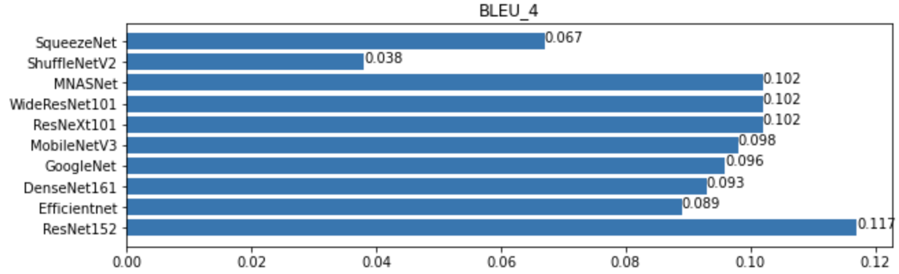
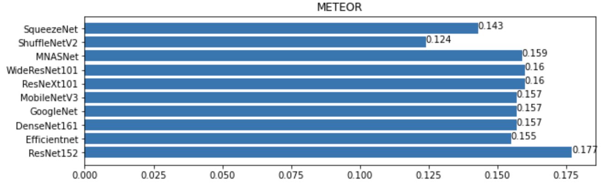
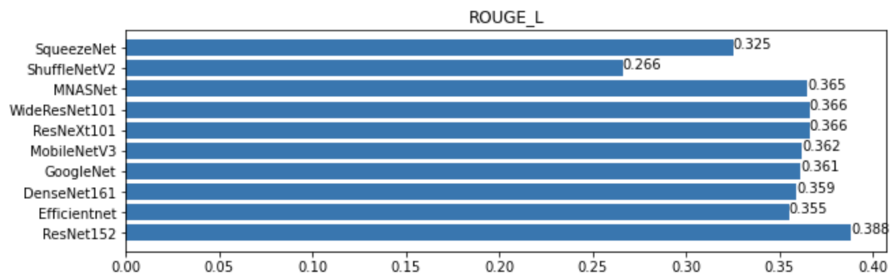
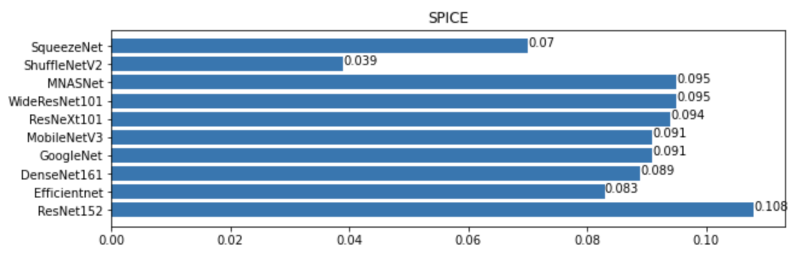

### Structural analysis of sentences
| Analysis Result |           |              |             |           |             |            |               |         |              |            |
|-----------------|-----------|--------------|-------------|-----------|-------------|------------|---------------|---------|--------------|------------|
| IMAGE           | ResNet152 | Efficientnet | DenseNet161 | GoogleNet | MobileNetV3 | ResNeXt101 | WideResNet101 | MNASNet | ShuffleNetV2 | SqueezeNet |
| 1               | 6         | 6            | 7           | 7         | 3           | 9          | 7             | 3       | 0            | 6          |
| 2               | 10        | 1            | 9           | 0         | 2           | 1          | 7             | 6       | 0            | 0          |
| 3               | 4         | 3            | 6           | 1         | 3           | 0          | 0             | 0       | 0            | 0          |
| 4               | 3         | 6            | 3           | 9         | 1           | 7          | 7             | 1       | 1            | 1          |
| 5               | 4         | 0            | 4           | 1         | 0           | 1          | 2             | 2       | 0            | 5          |
| 6               | 10        | 1            | 0           | 7         | 7           | 7          | 0             | 10      | 0            | 3          |
| 7               | 0         | 0            | 0           | 0         | 0           | 0          | 0             | 0       | 0            | 0          |
| 8               | 1         | 1            | 1           | 1         | 1           | 1          | 2             | 1       | 1            | 1          |
| 9               | 1         | 2            | 1           | 2         | 0           | 2          | 0             | 0       | 1            | 0          |
| 10              | 5         | 4            | 1           | 9         | 2           | 9          | 9             | 0       | 0            | 3          |
|                 |           |              |             |           |             |            |               |         |              |            |
|       MEAN      | 4.4       | 2.4          | 3.2         | 3.7       | 1.9         | 3.7        | 3.4           | 2.3     | 0.3          | 1.9        |
|      STDEV      | 3.50      | 2.27         | 3.19        | 3.80      | 2.13        | 3.80       | 3.66          | 3.30    | 0.48         | 2.23       |

### Analysis
The quantitative evaluation metrics indicated that ResNet-152 did the best score and MNASNet, WideResNet101, and ResNeXt101 did the second best scores.
The structural analysis of sentences indicated that ResNet-152 did the best score and GoogleNet and ResNeXt101 did the second best, then the WideResNet101 did the third best.
Consequently, the ResNet152 showed did the best among the other encoders in both evaluations. However, all the encoders showed the weaknesses in predicting animal behaviors and the situations that people do not face in normal life, such as digging a ground or marching while playing musical instruments.

### Improvements
The model can be trained better with improved attention mechanisms and decoder models. 
Moreover, the model may require more dataset to learn the actions of the objects. Although the encoders were pretrained with ImageNet,  the ImageNet is about Image Classificaiton and the Classificaiton does not include what actions are taken in the images. 

## Appendix
### Inferences on 10 Random Images
As shown in the table, through the structural analysis of sentences, ResNet152 showed the best results among other encoders and GoogleNet, ResNeXt-101, and WideResNet101 showed the next best results among others.
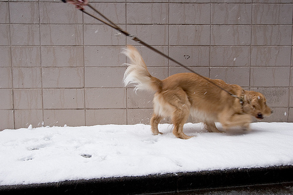
| Predicted Captions                                                                                                   |
|----------------------------------------------------------------------------------------------------------------------|
| ResNet152   :  <start> a dog is running past   a chain link fence . <end>                                            |
| Efficientnet :  <start> a brown dog is running in the   grass between obstacles on a course <end>                    |
| DenseNet161 :  <start> a brown dog is running   through snowy woodland . <end>                                       |
| GoogleNet :  <start> a dog is running through a   tunnel <end>                                                       |
| MobileNetV3 :  <start> a dog is on the bed holding a   toy soccer ball . <end>                                       |
| ResNeXt101 :  <start> a brown dog is running   through the snow . <end>                                              |
| WideResNet101 :  <start> a dog is running down a   wooden staircase . <end>                                          |
| MNASNet :  <start> a dog jumps over a bar with a   ball in its mouth . <end>                                         |
| ShuffleNetV2 :  <start> a man in a black jacket is   holding a microphone toward a young girl with long brown hair . |
| SqueezeNet :  <start> a brown dog is running across   a low cut field of another with a furry tree . <end>           |               

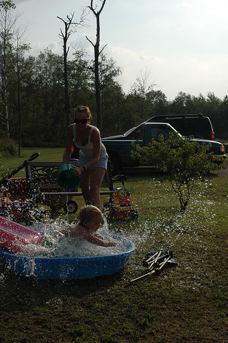
| Predicted Captions                                                                                                        |
|---------------------------------------------------------------------------------------------------------------------------|
| ResNet152   :  <start> a boy and a girl are   playing in a pool in a park . <end>                                         |
| Efficientnet :  <start> a man in a green t-shirt is   skateboarding along a graffiti covered wall in front of a blue door |
| DenseNet161 :  <start> a boy in a yellow life vest   jumping into a pool . <end>                                          |
| GoogleNet :  <start> a man is kayaking in the   ocean on a beach . <end>                                                  |
| MobileNetV3 :  <start> a boy in a red shirt and a   boy in a yellow shirt are jumping on a trampoline outside             |
| ResNeXt101 :  <start> a man in a yellow shirt and a   girl in a blue shirt are smiling while wearing a brown              |
| WideResNet101 :  <start> a young boy and girl are   playing in a mud puddle . <end>                                       |
| MNASNet :  <start> a girl in a bathing suit   plays on the surf . <end>                                                   |
| ShuffleNetV2 :  <start> a man in a black jacket is   holding a microphone toward a young girl with long brown hair .      |
| SqueezeNet :  <start> a man is riding a bike   through a wooded area near some trees . <end>                              |
                                                                                                                        |

| Predicted Captions                                                                                                   |
|----------------------------------------------------------------------------------------------------------------------|
| ResNet152   :  <start> a man in a green   jacket holding a small child on a rope . <end>                             |
| Efficientnet :  <start> a man in a green shirt is   skating on a railing . <end>                                     |
| DenseNet161 :  <start> a row of people is marching   in the sand in front of a <unk> building . <end>                |
| GoogleNet :  <start> a group of people are looking   at the view of a large building . <end>                         |
| MobileNetV3 :  <start> a man is sitting at an   outside bar near many soda and beer cans . <end>                     |
| ResNeXt101 :  <start> a group of children in a   church <unk> play <unk> and <unk> . <end>                           |
| WideResNet101 :  <start> a young girl wearing a blue   leotard jumps in the air while playing in the snow . <end>    |
| MNASNet :  <start> a little girl in a red   snowsuit sits on a snowball in a backyard . <end>                        |
| ShuffleNetV2 :  <start> a man in a black jacket is   holding a microphone toward a young girl with long brown hair . |
| SqueezeNet :  <start> a child is standing on the   side of a street with their backs to the large brown and white    |
                                                                                                                    |
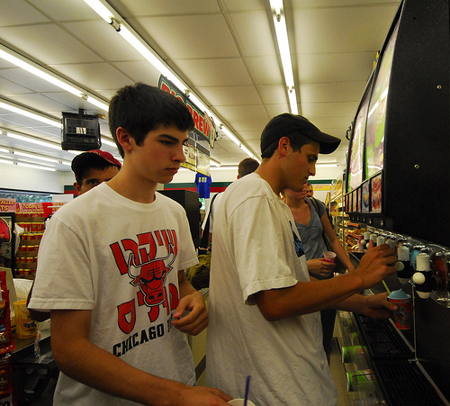
| Predicted Captions                                                                                                   |
|----------------------------------------------------------------------------------------------------------------------|
| ResNet152   :  <start> a man in a suit is   standing in a stadium with a <unk> in sign . <end>                       |
| Efficientnet :  <start> a man in a white shirt is   standing in a tent holding a <unk> or guitar . <end>             |
| DenseNet161 :  <start> a man is holding up a plastic   jug indoors . <end>                                           |
| GoogleNet :  <start> a man in a white shirt is   standing in a <unk> store with a crowd behind him . <end>           |
| MobileNetV3 :  <start> a man wearing a cowboy hat   and a gold cross around his neck <end>                           |
| ResNeXt101 :  <start> a man in a blue shirt is   operating a <unk> while another man looks on . <end>                |
| WideResNet101 :  <start> a man in a black jacket is   standing beside the woman holding a cup and is wearing a hat   |
| MNASNet :  <start> a man is standing behind and   desk and there is part of a red car hanging above his head         |
| ShuffleNetV2 :  <start> a man in a black jacket is   holding a microphone toward a young girl with long brown hair . |
| SqueezeNet :  <start> a man with a guitar holds a   child who is sitting behind him . <end>                          |
     
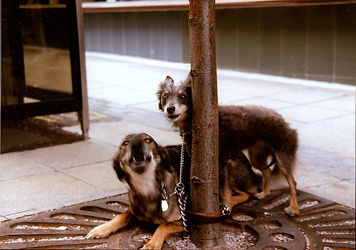
| Predicted Captions                                                                                                   |
|----------------------------------------------------------------------------------------------------------------------|
| ResNet152   :  <start> a dog is looking at a   tennis ball . <end>                                                   |
| Efficientnet :  <start> a man in a green shirt climbs   an indoor climbing wall . <end>                              |
| DenseNet161 :  <start> a brown dog is looking at a   black horse that is sticking its head through a fence . <end>   |
| GoogleNet :  <start> a dog jumps over a hurdle in   the grass . <end>                                                |
| MobileNetV3 :  <start> a young boy is playing in the   water . <end>                                                 |
| ResNeXt101 :  <start> a dog is bringing a man on a   stick . <end>                                                   |
| WideResNet101 :  <start> a black and white dog is   <unk> whilst catching a yellow ball in his mouth . <end>         |
| MNASNet :  <start> a dog jumps off a wooden   porch . <end>                                                          |
| ShuffleNetV2 :  <start> a man in a black jacket is   holding a microphone toward a young girl with long brown hair . |
| SqueezeNet :  <start> a brown and black dog sitting   on a bench . <end>                                             |
  
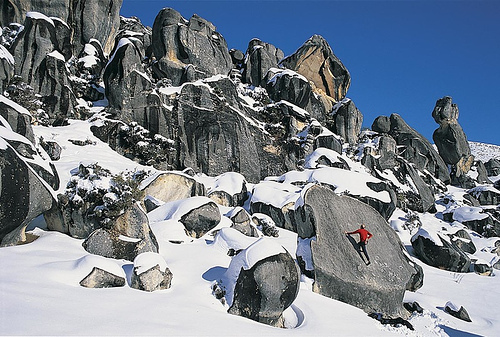   
| Predicted Captions                                                                                                   |
|----------------------------------------------------------------------------------------------------------------------|
| ResNet152   :  <start> people are standing on   a snow covered hill watching the mountain range . <end>              |
| Efficientnet :  <start> a person in a black jacket is   snowboarding during the evening . <end>                      |
| DenseNet161 :  <start> a group of people are   standing on a ledge overlooking low clouds . <end>                    |
| GoogleNet :  <start> a group of people are   standing in the snow with brooms . <end>                                |
| MobileNetV3 :  <start> a group of people stand in   the snow in a mountain . <end>                                   |
| ResNeXt101 :  <start> a group of people are   standing in front of a mountain scene in the snow . <end>              |
| WideResNet101 :  <start> a skier is coming down a hill   . <end>                                                     |
| MNASNet :  <start> a person stands in the snow   at the bottom of a snow covered mountain . <end>                    |
| ShuffleNetV2 :  <start> a man in a black jacket is   holding a microphone toward a young girl with long brown hair . |
| SqueezeNet :  <start> a person is on a snowboard   with a snowboard in the air . <end>                               |

  
| Predicted Captions                                                                                                   |
|----------------------------------------------------------------------------------------------------------------------|
| ResNet152   :  <start> a man in a wetsuit   <unk> water . <end>                                                      |
| Efficientnet :  <start> a man in a wetsuit is surfing   on a green surfboard . <end>                                 |
| DenseNet161 :  <start> a man hangs from one while   another man watches . <end>                                      |
| GoogleNet :  <start> a man is kayaking down a   waterfall . <end>                                                    |
| MobileNetV3 :  <start> a man in a wetsuit is surfing   on a green surfboard . <end>                                  |
| ResNeXt101 :  <start> a group of people swimming in   a lake <end>                                                   |
| WideResNet101 :  <start> a man in a swimsuit is doing   a back flip off a rock whilst another boy watching . <end>   |
| MNASNet :  <start> a young boy in a black   wetsuit is surfing . <end>                                               |
| ShuffleNetV2 :  <start> a man in a black jacket is   holding a microphone toward a young girl with long brown hair . |
| SqueezeNet :  <start> a dog swims in a lake .   <end>                                                                |

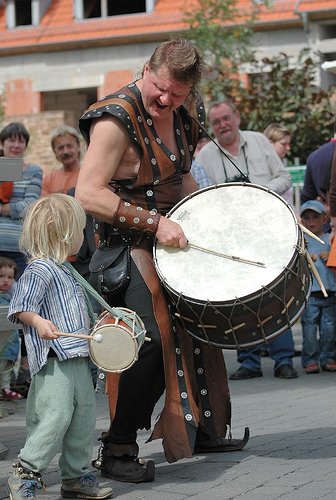  
| Predicted Captions                                                                                                       |
|--------------------------------------------------------------------------------------------------------------------------|
| ResNet152   :  <start> a man wearing a white   shirt and tie is playing a game of french games in a green sports         |
| Efficientnet :  <start> a man in a green shirt is   skating on a railing . <end>                                         |
| DenseNet161 :  <start> a man with a blue coat and a   red hat is holding up a sign . <end>                               |
| GoogleNet :  <start> a man in a black shirt and   jeans stands in front of a building playing a game . <end>             |
| MobileNetV3 :  <start> a man wearing a black shirt   and a girl wearing an orange shirt sitting on the pavement eating . |
| ResNeXt101 :  <start> a man with a <unk> pop   and a woman wearing a black jacket and white hat in a crowd               |
| WideResNet101 :  <start> a man in a red shirt stands   next to a blue and white wall in a parking lot .                  |
| MNASNet :  <start> a man in a blue jacket lifts   a child dressed in red out boat crowded with people <end>              |
| ShuffleNetV2 :  <start> a man in a black jacket is   holding a microphone toward a young girl with long brown hair .     |
| SqueezeNet :  <start> a group of basketball players   in front of a <unk> . <end>                                        |

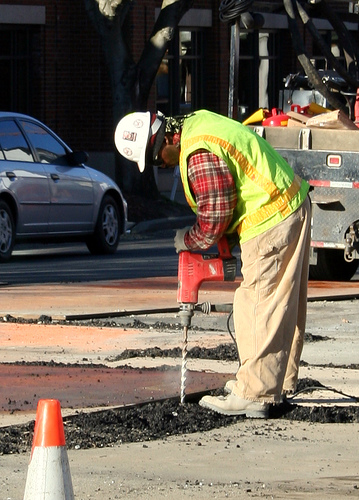  
| Predicted Captions                                                                                                   |
|----------------------------------------------------------------------------------------------------------------------|
| ResNet152   :  <start> a man in a black   hoodie is holding a <unk> and shopping cart . <end>                        |
| Efficientnet :  <start> a man in a green shirt is   skating on a railing . <end>                                     |
| DenseNet161 :  <start> a man in a blue shirt is   walking barefoot . <end>                                           |
| GoogleNet :  <start> a man in a yellow jacket is   riding a bicycle in the street . <end>                            |
| MobileNetV3 :  <start> a young girl is walking up a   steep grassy hill . <end>                                      |
| ResNeXt101 :  <start> a boy wearing a yellow shirt   and blue pants is holding a cup in the air . <end>              |
| WideResNet101 :  <start> a woman in a red jacket and   orange glasses is jogging . <end>                             |
| MNASNet :  <start> a boy in a blue shirt is   posing in front of an igloo type building with a person dangling       |
| ShuffleNetV2 :  <start> a man in a black jacket is   holding a microphone toward a young girl with long brown hair . |
| SqueezeNet :  <start> a man is sitting in front of   a orange race car . <end>                                       |

| Predicted Captions                                                                                                   |
|----------------------------------------------------------------------------------------------------------------------|
| ResNet152   :  <start> a man in a blue coat   and red hat is standing in front of a bar with a beer                  |
| Efficientnet :  <start> a man with a <unk>   haircut is waiting to catch a child that he has thrown into the air     |
| DenseNet161 :  <start> a man in a hat at a protest   is looking down . <end>                                         |
| GoogleNet :  <start> a man in a red shirt is   standing at the foot of a coffee shop . <end>                         |
| MobileNetV3 :  <start> a man is sitting on a couch   holding a baby while surrounded by children . <end>             |
| ResNeXt101 :  <start> a man in a red jacket and hat   talks to another man . <end>                                   |
| WideResNet101 :  <start> a man in a red jacket is   standing in front of a sign selling <unk> . <end>                |
| MNASNet :  <start> a young boy jumping and a   young girl seating in an inflatable pool <end>                        |
| ShuffleNetV2 :  <start> a man in a black jacket is   holding a microphone toward a young girl with long brown hair . |
| SqueezeNet :  <start> a man is sitting in front of   a orange race car . <end>                                       |

## Reference
https://github.com/ntrang086/image_captioning
https://github.com/helloMickey/caption_eval
https://github.com/ndb796/Deep-Learning-Paper-Review-and-Practice/blob/master/code_practices/Neural_Image_Captioning_(NIC)_Using_ResNet_101.ipynb

